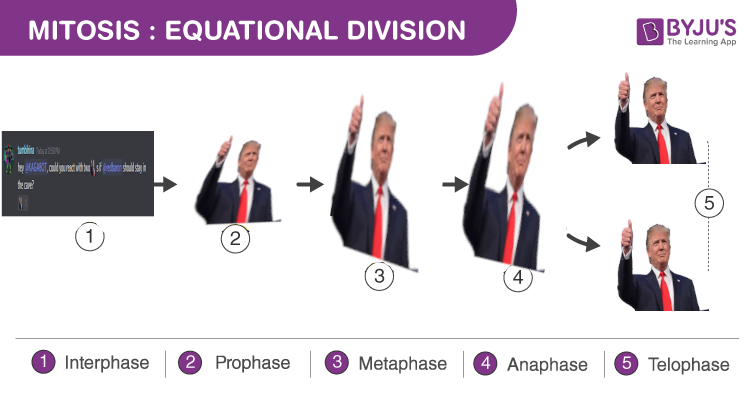

# KAGA

**This is an ironic creation. Fuck Trump.**

## Origins
On a specific Discord Server I'm in, there is an emoji; :kaga:. Up to the 2020 election, it became a bit of a meme to 'react' to pro-Trump messages with this emoji. Seeing this to be *slightly* annoying to manually do, I began to develop a Discord bot.

On November 3rd, 2020, the bot was done. Given the invite link, and once I figured out the kinks, KAGABOT was unleashed at 11:21AM.

Many memes were had. Eventually, once the AP called the election a couple of days later, on the 7th at 2:30PM, it was shot.

RIP KAGABOT. Maybe I'll make a BIDENBOT.

## Requirements / Setting Up
Requires node.js and discord.js, and a 'config.json' file with:
- a 'channel' token, a string that has the required channel name (KAGABOT will only operate in this given channel)
- a 'token' token, a string that Discord gives you to access their API on a specific bot account

In the discord server, there needs to be two emojis:
- 'kaga'
- 'okbuddy'